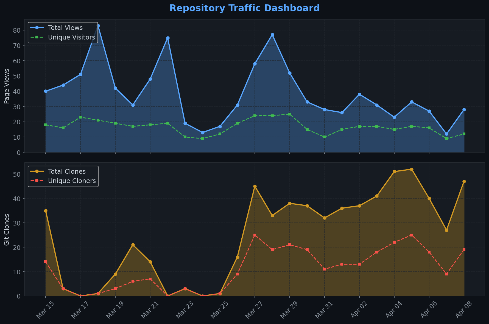
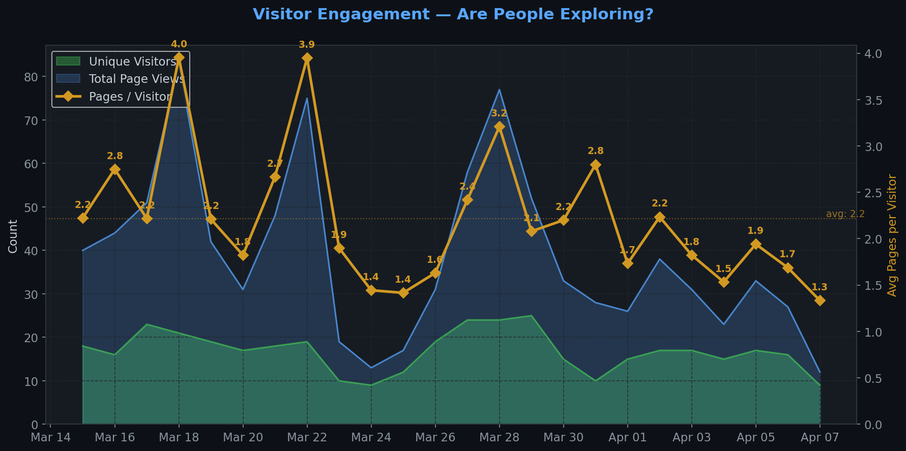
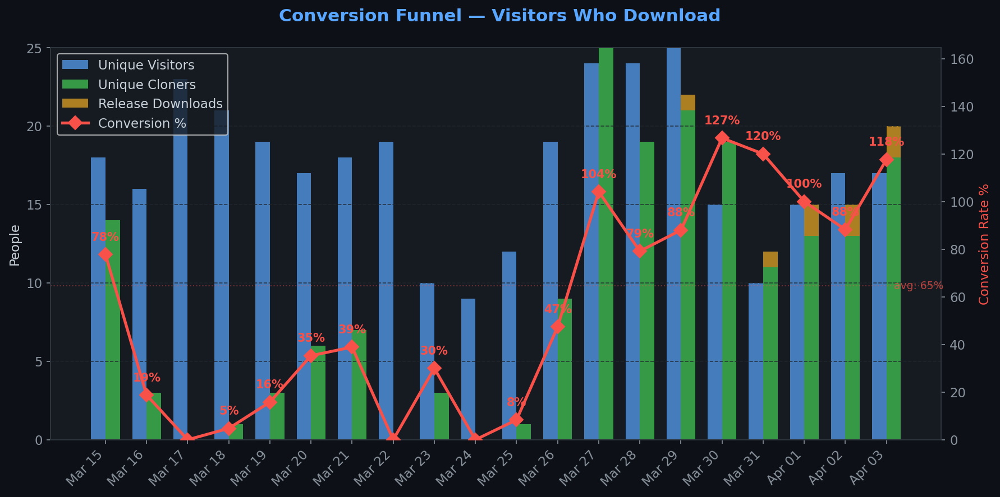
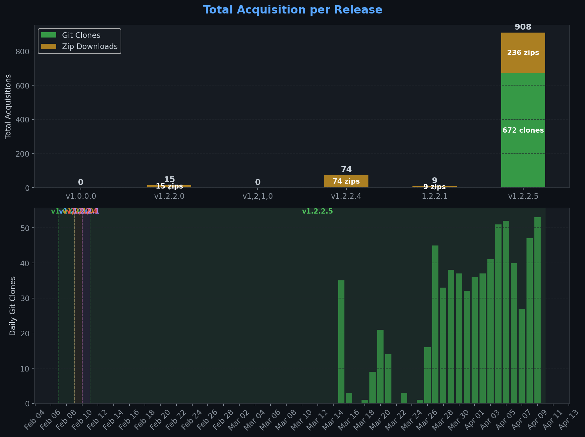
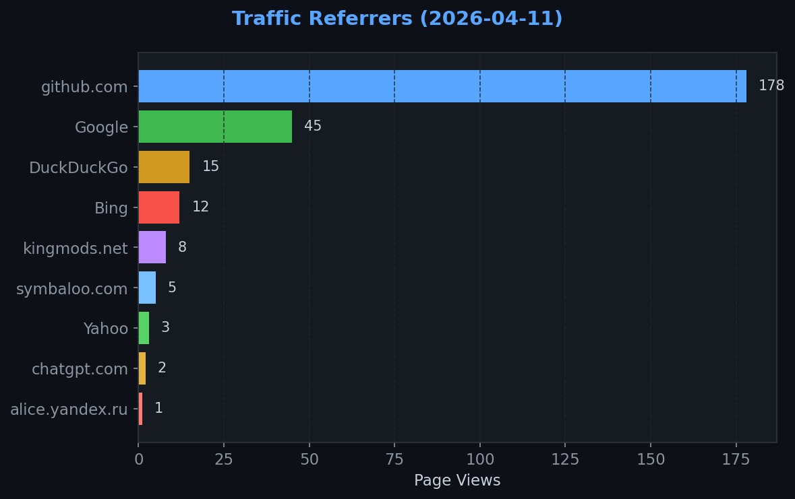
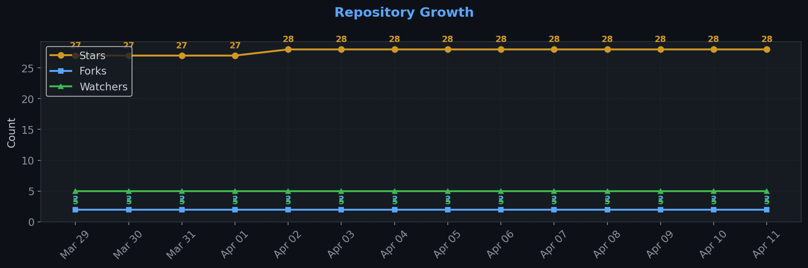

# Repository Traffic Dashboard

**Last updated:** 2026-04-11T06:44:33Z
**Days tracked:** 14 | **Download snapshots:** 57 (hourly)

---

## Views & Clones (14-day window, preserved forever)

| Metric | 14-Day Total | Unique |
|--------|-------------|--------|
| Page Views | 484 | 158 |
| Git Clones | 569 | 219 |

> **Engagement:** 3.0 pages per visitor (14-day avg)

---

## Visitor Engagement

> Higher = visitors exploring more pages. 1.0 = bounce. 3.0+ = deeply engaged.

---

## Conversion Funnel

> **14-day conversion:** 553 of 158 visitors cloned or downloaded (**350.0%**)
>
> Unique cloners: 219 | Release downloads: 334

---

## Total Acquisition per Release (Downloads + Clones)

| Channel | Count |
|---------|-------|
| Zip Downloads | 334 |
| Git Clones (14-day) | 569 |
| **Total Acquisitions** | **903** |

---

## Referrers

| Source | Views | Unique |
|--------|-------|--------|
| github.com | 178 | 61 |
| Google | 45 | 27 |
| DuckDuckGo | 15 | 1 |
| Bing | 12 | 7 |
| kingmods.net | 8 | 3 |
| symbaloo.com | 5 | 1 |
| Yahoo | 3 | 2 |
| chatgpt.com | 2 | 1 |
| alice.yandex.ru | 1 | 1 |

---

## Repository Growth

| Metric | Current |
|--------|---------|
| Stars | 28 |
| Forks | 2 |
| Watchers | 5 |

---

## Top Pages (14-day)

| Page | Views | Unique |
|------|-------|--------|
| `/TheCodingDad-TisonK/FS25_NPCFavor` | 265 | 134 |
| `/TheCodingDad-TisonK/FS25_NPCFavor/releases` | 41 | 21 |
| `/TheCodingDad-TisonK/FS25_NPCFavor/tree/development` | 38 | 12 |
| `/TheCodingDad-TisonK/FS25_NPCFavor/releases/tag/v1.2.2.5` | 24 | 13 |
| `/TheCodingDad-TisonK/FS25_NPCFavor/issues` | 19 | 12 |
| `/TheCodingDad-TisonK/FS25_NPCFavor/issues/21` | 7 | 6 |
| `/TheCodingDad-TisonK/FS25_NPCFavor/issues/43` | 7 | 3 |
| `/TheCodingDad-TisonK/FS25_NPCFavor/pull/41` | 6 | 3 |
| `/TheCodingDad-TisonK/FS25_NPCFavor/pulls` | 5 | 5 |
| `/TheCodingDad-TisonK/FS25_NPCFavor/tree/traffic-stats` | 5 | 3 |

---

## Data Files

| File | Description | Granularity |
|------|-------------|-------------|
| [daily.json](daily.json) | Views & clones per day (never expires) | Daily |
| [downloads.json](downloads.json) | Release download snapshots | Hourly |
| [referrers.json](referrers.json) | Referrer snapshots | Daily |
| [metadata.json](metadata.json) | Stars, forks, watchers | Daily |
| [stats.json](stats.json) | Combined legacy snapshots | 6-hourly |

---
*Hourly download tracking + full dashboard with engagement metrics every 6 hours*
*Auto-generated by [traffic-stats.yml](../../.github/workflows/traffic-stats.yml)*
